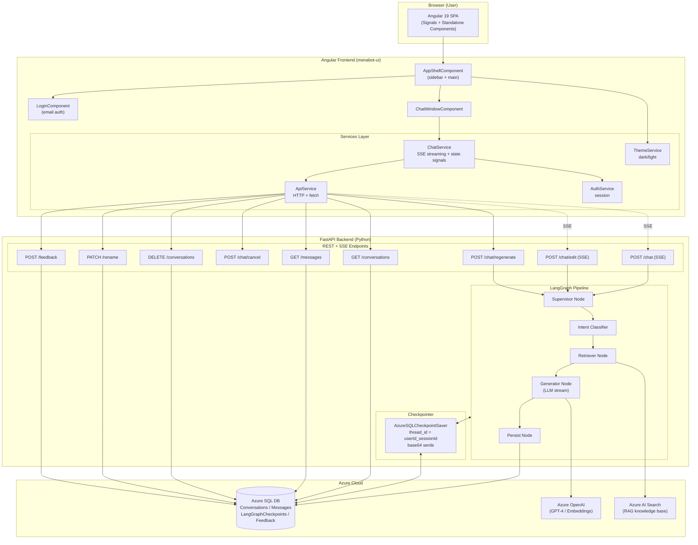
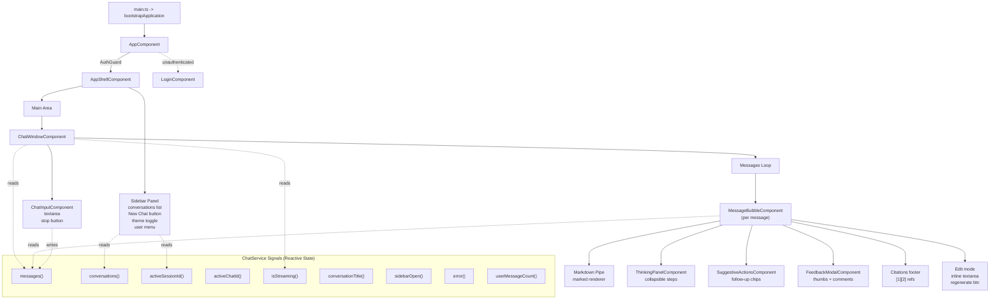
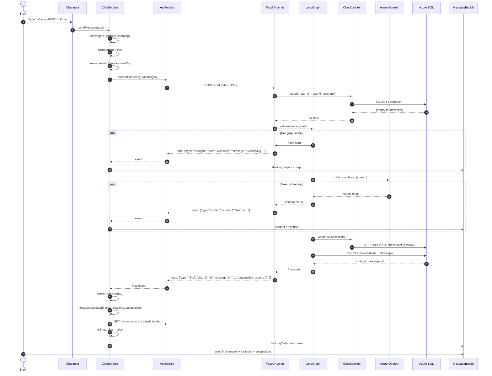
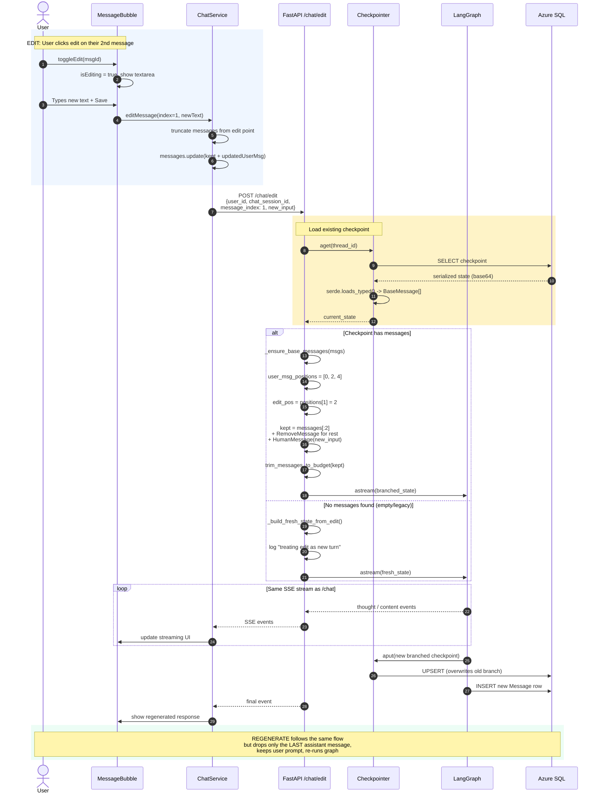
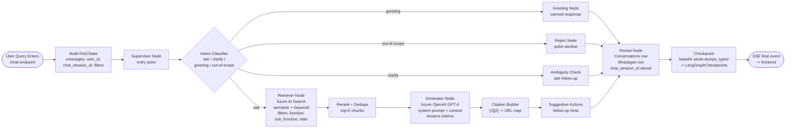

# MenaBot — Enterprise RAG Chatbot

A production-ready RAG chatbot built on **FastAPI + LangGraph** (Python backend) and **Angular 19** (frontend), with Azure SQL for persistence, Azure OpenAI for LLM, and Azure AI Search for retrieval.

---

## Table of Contents

1. [Overview](#overview)
2. [Tech Stack](#tech-stack)
3. [System Architecture](#1-system-architecture-block-diagram)
4. [Frontend Component Tree](#2-frontend-component-tree--state-flow)
5. [Send Message Flow](#3-send-message-flow-end-to-end-sse)
6. [Edit / Regenerate Flow](#4-edit--regenerate-flow-checkpoint-branching)
7. [LangGraph RAG Pipeline](#5-langgraph-rag-pipeline-node-level-detail)
8. [Feature Inventory](#feature-inventory)
9. [Getting Started](#getting-started)
10. [Project Structure](#project-structure)
11. [Key Design Decisions](#key-design-decisions)

---

## Overview

MenaBot is a domain-scoped Retrieval-Augmented Generation (RAG) chatbot designed for enterprise internal use. It supports:

- **Streaming answers** over Server-Sent Events with live chain-of-thought steps
- **Full conversation history** with edit-and-branch and regenerate-response
- **Checkpointed state** via LangGraph persisted in Azure SQL
- **Citations** drawn from a curated Azure AI Search knowledge base
- **Feedback loops** (thumbs up / down + freeform comments)
- **Multi-user isolation** by `user_id` and `chat_session_id`

---

## Tech Stack

| Layer | Technology |
|-------|------------|
| Frontend | Angular 19 (standalone components, signals, OnPush CD) |
| Styling | SCSS |
| Markdown | `marked` |
| Backend | FastAPI (Python 3.11+) |
| Orchestration | LangGraph + LangChain |
| LLM | Azure OpenAI (GPT-4 / configurable deployment) |
| Retrieval | Azure AI Search (hybrid semantic + keyword) |
| Persistence | Azure SQL Database (pyodbc) |
| Streaming | Server-Sent Events (SSE) |
| State Mgmt (FE) | Angular Signals |

---

## 1. System Architecture (Block Diagram)



---

## 2. Frontend Component Tree & State Flow



---

## 3. Send Message Flow (End-to-End SSE)



---

## 4. Edit / Regenerate Flow (Checkpoint Branching)



---

## 5. LangGraph RAG Pipeline (Node-Level Detail)



---

## Feature Inventory

| Area | Feature | Where Implemented |
|------|---------|-------------------|
| **Auth** | Email login, session persistence | `AuthService`, `LoginComponent`, `AuthGuard` |
| **Chat** | Send message w/ SSE streaming | `ChatService.sendMessage` -> `/chat` |
| **Chat** | Thinking steps (chain-of-thought) | `ThinkingPanelComponent` + `thought` events |
| **Chat** | Live token streaming | `content` events -> signal updates |
| **Chat** | Citations `[1][2] URL` | `parseCitations()` -> footer |
| **Chat** | Suggestive follow-ups | `SuggestiveActionsComponent` |
| **Chat** | Cancel in-flight stream | `AbortController` + `/chat/cancel` |
| **Chat** | Edit any user message | `editMessage()` -> `/chat/edit` w/ checkpoint branching |
| **Chat** | Regenerate last response | `regenerate()` -> `/chat/regenerate` |
| **Chat** | Markdown rendering | `markdown.pipe.ts` + `marked` |
| **History** | Conversation sidebar | `/conversations` -> `ChatService.conversations` signal |
| **History** | Load past chat | `/messages` + restore `chat_session_id` |
| **History** | Rename conversation | `PATCH /rename` |
| **History** | Delete conversation | `DELETE /conversations/:id` |
| **Feedback** | Thumbs up/down + comments | `FeedbackModalComponent` -> `/feedback` |
| **UI/UX** | Dark/light theme | `ThemeService` |
| **UI/UX** | Sidebar toggle (mobile) | `sidebarOpen` signal |
| **Backend** | LangGraph checkpointing | `AzureSQLCheckpointSaver` (base64 serde) |
| **Backend** | Thread keying | `thread_id = userId_chatSessionId` |
| **Backend** | SQL persistence | `Conversations`, `Messages`, `Feedback` tables |
| **Backend** | Retrieval | Azure AI Search |
| **Backend** | LLM | Azure OpenAI (configurable deployment) |

---

## Getting Started

### Prerequisites

- Python 3.11+
- Node.js 20+
- Azure SQL Database with ODBC driver 18
- Azure OpenAI endpoint + API key
- Azure AI Search endpoint + admin key

### Backend Setup

```bash
# Install dependencies
pip install -r requirements.txt

# Configure environment
cp .env.example .env
# Fill in AZURE_SQL_*, AZURE_OPENAI_*, AZURE_SEARCH_* variables

# Run the API
python app.py
# or with uvicorn
uvicorn app:app --host 0.0.0.0 --port 8000 --reload
```

The backend will:
- Auto-create `Conversations`, `Messages`, `LangGraphCheckpoints`, `Feedback` tables on first run
- Apply any pending column migrations (e.g. `ChatSessionId`)
- Listen on `http://localhost:8000`

### Frontend Setup

```bash
cd demo/menabot-ui
npm install
npm start
```

Dev server runs on `http://localhost:4200`.

### Environment Variables (Backend)

| Variable | Description |
|----------|-------------|
| `AZURE_SQL_SERVER` | Azure SQL server hostname |
| `AZURE_SQL_DATABASE` | Database name |
| `AZURE_SQL_USERNAME` | SQL user |
| `AZURE_SQL_PASSWORD` | SQL password |
| `AZURE_OPENAI_ENDPOINT` | Azure OpenAI resource URL |
| `AZURE_OPENAI_API_KEY` | API key |
| `AZURE_OPENAI_DEPLOYMENT` | Deployment name (e.g. `gpt-4o`) |
| `AZURE_OPENAI_API_VERSION` | e.g. `2024-08-01-preview` |
| `AZURE_SEARCH_ENDPOINT` | Azure AI Search URL |
| `AZURE_SEARCH_API_KEY` | Admin key |
| `AZURE_SEARCH_INDEX` | Index name |
| `MAX_INPUT_LENGTH` | Max chars per user query |
| `RATE_LIMIT_PER_MINUTE` | Per-user request cap |

---

## Project Structure

```
.
├── app.py                          # FastAPI entry + endpoint handlers
├── config.py                       # Environment + constants
├── requirements.txt
├── graph/
│   ├── state.py                    # RAGState TypedDict
│   ├── context_manager.py          # Token-budget trimming
│   └── nodes/
│       ├── supervisor.py           # Graph builder + routing
│       ├── classifier.py
│       ├── retriever.py
│       ├── generator.py
│       └── persist_node.py         # Saves to Conversations/Messages
├── models/
│   └── chat_models.py              # Pydantic request/response schemas
├── services/
│   ├── sql_client.py               # Azure SQL CRUD (pyodbc)
│   └── checkpointer.py             # AzureSQLCheckpointSaver (sync + async)
└── demo/menabot-ui/                # Angular 19 frontend
    ├── angular.json
    ├── package.json
    └── src/app/
        ├── app.component.ts
        ├── app.routes.ts
        ├── components/
        │   ├── app-shell/
        │   ├── login/
        │   ├── chat-window/
        │   ├── chat-input/
        │   ├── message-bubble/
        │   ├── thinking-panel/
        │   ├── suggestive-actions/
        │   └── feedback-modal/
        ├── services/
        │   ├── chat.service.ts     # Central state + SSE orchestrator
        │   ├── api.service.ts      # HTTP/fetch wrapper
        │   ├── auth.service.ts
        │   └── theme.service.ts
        ├── guards/
        │   └── auth.guard.ts
        ├── models/
        │   └── chat.models.ts      # TypeScript interfaces
        └── pipes/
            └── markdown.pipe.ts
```

---

## Key Design Decisions

### 1. `chat_session_id` vs `chat_id`

Two distinct identifiers with different lifecycles:

| ID | Source | Purpose |
|----|--------|---------|
| `chat_session_id` | Frontend-generated (`session_<ts>_<rand>`) | LangGraph thread key for checkpoints |
| `chat_id` | Azure SQL auto-increment | Row ID of `Conversations` table |

**Why both?** LangGraph needs the thread key *before* the first response is persisted, but `chat_id` only exists after the persist node runs. The `ChatSessionId` column on `Conversations` stores the original thread key so loaded conversations can resume their checkpoint for edit / regenerate.

### 2. Checkpoint Serialization (base64)

Earlier versions used `json.dumps(checkpoint, default=str)`, which stringified `BaseMessage` objects into their `repr()` form and broke round-tripping. Current implementation uses LangGraph's native `JsonPlusSerializer`:

```python
type_str, data_bytes = self.serde.dumps_typed(checkpoint)
payload = {
    "_type": type_str,
    "_encoding": "base64",
    "_data": base64.b64encode(data_bytes).decode("ascii"),
}
```

Base64 avoids lone-surrogate encoding issues with Azure SQL NVARCHAR columns. Legacy surrogateescape rows are still decoded transparently for backward compatibility.

### 3. SSE over POST (not EventSource)

`EventSource` only supports GET. We use `fetch` + `ReadableStream` so we can POST the request body containing `user_input`, filters, etc., while still consuming Server-Sent Events.

### 4. Angular Signals + OnPush

Every component is `ChangeDetectionStrategy.OnPush`. State lives exclusively in `ChatService` signals — no component-local duplication. This gives:

- Deterministic re-rendering (only components whose read signals change)
- Minimal CD overhead even with long chat histories
- Time-travel debugging is feasible (signals are snapshottable)

### 5. Edit as a Graph Branch

Editing a user message does **not** mutate existing SQL rows. Instead:

1. Load the last checkpoint
2. Reconstruct proper `BaseMessage` objects (handles legacy repr strings)
3. Find the absolute index of the Nth `HumanMessage`
4. Keep messages up to that point, append `RemoveMessage` for the rest
5. Append the edited `HumanMessage` and re-run the graph

The new checkpoint overwrites the old one at the same `thread_id` — effectively branching the conversation in place.

### 6. Graceful Fallback on Empty Checkpoints

If the checkpoint is missing or empty (legacy rows, DB reset), the edit endpoint logs a warning and treats the edit as a fresh chat turn rather than returning a 400 error. This makes the UI resilient against stale state.

---

## License

Internal project — see LICENSE file for terms.
